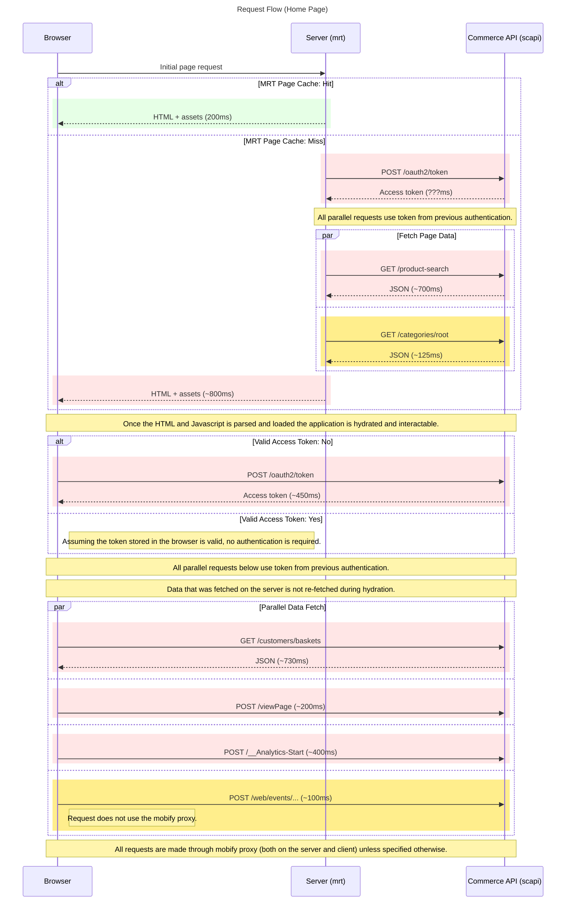

# Home Page

This directory contains the **Home Page** implementation for the Retail React App built on Salesforce’s PWA Kit.

The home page serves as the landing experience for users. It is optimized for performance, SEO, and personalization, with a mix of server-side rendering and client-side hydration.

---

## Page Responsibilities

* Showcasing promotional or featured product content (e.g., **top search results**).
* Displaying navigable **root-level category links**.
* Serving as a fast entry-point for customers with both cached and personalized content.

---

## Key Features

* **Product Discovery**: Shows a curated or default product search result.
* **Category Navigation**: Loads root categories from SCAPI to drive category tiles or menus.
* **Analytics & Tracking**: Triggers page view and custom web event analytics.
* **Personalization**: After hydration, it fetches customer-specific data such as their basket.

---

## Network Request Flow

The sequence diagram below outlines the data fetching flow between the Browser, the SSR Server (MRT), and SCAPI.

### Summary of Flow

#### On the Server (MRT):

* The browser requests the home page.
* If there's a **page cache hit**, MRT responds quickly (\~200ms).
* On a **cache miss**:

  * MRT requests a SCAPI **access token** (`/oauth2/token`).
  * Then, in **parallel**:

    * Fetches a default **product search** (`/product-search`)
    * Loads **root category data** (`/categories/root`)
  * HTML and assets are sent back to the browser (\~800ms total on miss).

#### On the Client (Browser):

* Hydrates the page after loading JS.
* If there's **no valid token**, it calls `/oauth2/token` (\~450ms).
* Then, it fires several requests in **parallel**:

  * Updated **product search** (`/product-search`)
  * **Root categories** (`/categories/root`)
  * **Basket data** (`/customers/baskets`)
  * Page analytics:

    * `/viewPage`
    * `/__Analytics-Start`
    * `/web/events/...` (bypasses Mobify proxy)

---

## Notes

* SCAPI requests are routed through the **Mobify proxy** unless explicitly excluded (e.g., `web/events`).
* On both server and client, a single valid **access token** is reused across parallel SCAPI calls.
* The server-rendered HTML provides a fast first contentful paint, while the client requests further personalize the experience.
