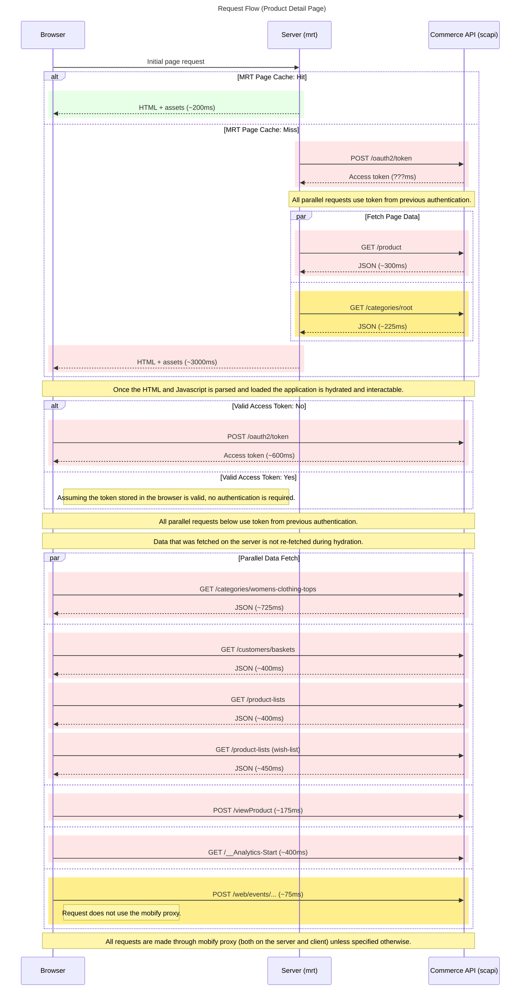

# Product Detail Page

This directory contains the implementation of the **Product Detail Page** for the PWA Kit-based Retail React App.

It handles:

* Rendering product information such as images, price, and description.
* Fetching category and wishlist data.
* Supporting server-side rendering (SSR) and hydration on the client.
* Coordinating data from multiple Salesforce Commerce API (SCAPI) endpoints.

## Page Responsibilities

* **Server-side (MRT)**: Pre-renders the page for initial load, including product and category data, if not served from cache.
* **Client-side**: Hydrates the page and performs additional API calls to fetch live and personalized data (e.g., basket, wishlist, analytics).

---

## Network Request Flow

The following sequence diagram outlines the network activity involved in rendering the product detail page, both on the server and client.

### Summary of Flow

#### On the Server (MRT):

* **Initial Page Request** is received by the server.
* If the **page is cached**, the response is quick (\~200ms).
* If **not cached**:

  * MRT authenticates with SCAPI (`/oauth2/token`).
  * Makes **parallel** SCAPI calls to:

    * Fetch product data (`/product`)
    * Fetch root category (`/categories/root`)
  * Sends the full HTML and assets to the browser (\~3000ms total).

#### On the Client (Browser):

* Once the HTML and JS are parsed, the app **hydrates**.
* If there's **no valid access token**, the browser authenticates with SCAPI.
* Then, the browser performs **multiple parallel requests**, including:

  * Product details (`/products/{id}`)
  * Category hierarchy (`/categories/...`)
  * Current basket (`/customers/baskets`)
  * Wishlist and product lists (`/product-lists`)
  * Analytics tracking (`/viewProduct`, `/__Analytics-Start`, `/web/events/...`)

#### Other Notes:

* All requests go through the **Mobify proxy**, unless explicitly noted (like `/web/events/...`).
* The server and browser **reuse** the same SCAPI access token where possible.
* The SSR and hydration steps ensure a fast, SEO-friendly, and interactive product page.
