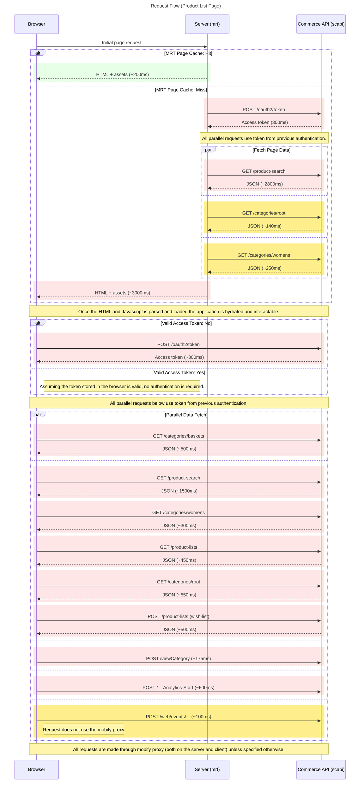

# Product List Page

This directory contains the implementation of the **Product List Page** for the PWA Kit-based Retail React App.

It supports:

* Server-side rendering (SSR) of product search results.
* Filtering and navigation across category pages.
* Client-side hydration and subsequent personalization.

---

## Page Responsibilities

* **Server-side (MRT)**:

  * Serves cached HTML if available.
  * Otherwise, fetches product search results and category metadata before rendering.
* **Client-side**:

  * Hydrates the app.
  * Fetches personalized and dynamic data like customer baskets, wishlists, and analytics.

---

## Network Request Flow

The following sequence diagram shows how the Product List Page coordinates network activity between the browser, the server (MRT), and Salesforce Commerce APIs (SCAPI):

### Summary of Flow

#### On the Server (MRT):

* The browser initiates the request for the product list page.
* If the **page is cached**, it's returned quickly (\~200ms).
* If it's a **cache miss**:

  * MRT authenticates with SCAPI (`/oauth2/token`).
  * Then, **in parallel**, it requests:

    * Product search results (`/product-search`)
    * Root category metadata (`/categories/root`)
    * Subcategory data (e.g. `/categories/womens`)
  * MRT sends rendered HTML + JS back to the browser (\~3000ms).

#### On the Client (Browser):

* Once hydrated, the browser verifies if it has a valid SCAPI access token.
* If not, it authenticates by calling `/oauth2/token` (\~300ms).
* Then, several **parallel requests** are made for:

  * Product search results (`/product-search`)
  * Category data (root and subcategories)
  * Basket and wishlist data
  * Product lists (`/product-lists`, including wishlist)
  * Analytics events (`/viewCategory`, `/__Analytics-Start`, `/web/events/...`)

#### Additional Notes:

* Requests go through the **Mobify proxy** unless noted otherwise (e.g., some analytics).
* Both the server and client **reuse SCAPI access tokens** when valid.
* SSR ensures fast, SEO-optimized loading, while client-side hydration enables personalization and interactivity.
